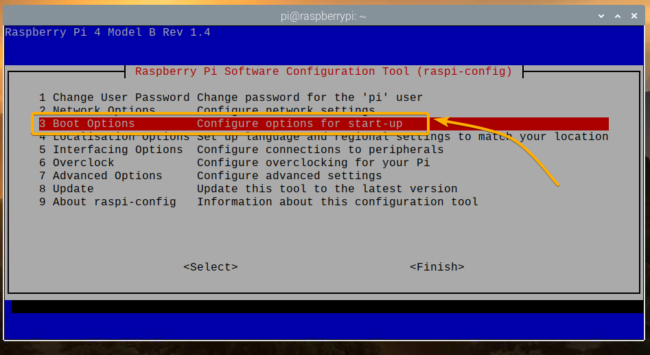
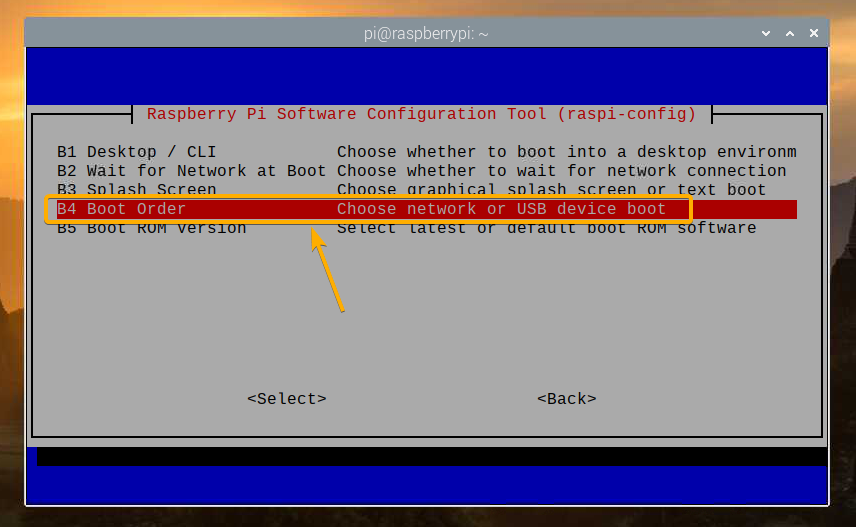
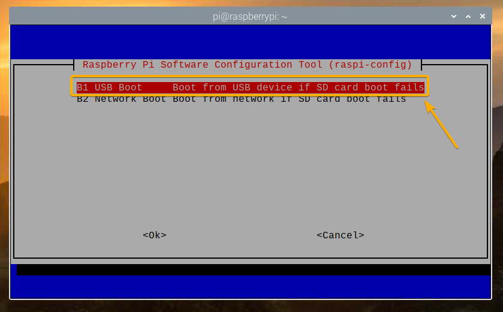
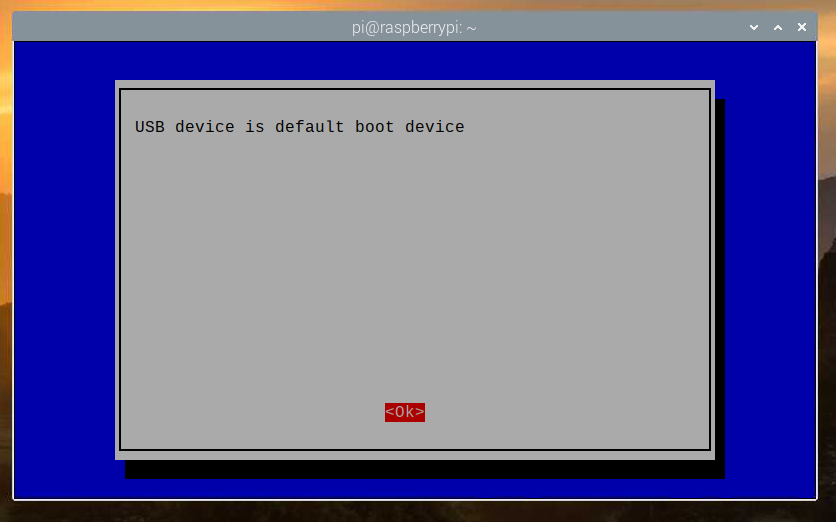
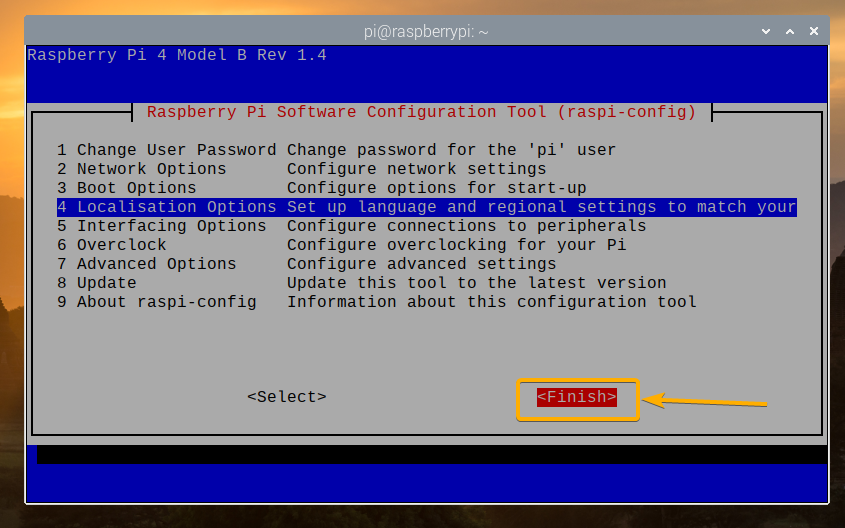
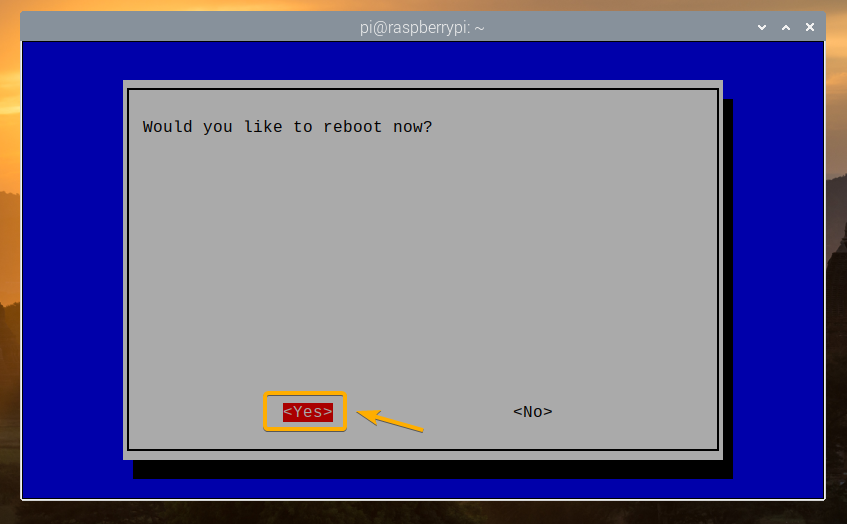

This README has been written with [Typora](https://typora.io/) software.

[TOC]

# [Delirio-Pi](https://github.com/MikeLirio/flower-pi)

Documentation and configuration of our Raspberry Pi.

Repository linked to @github/MikeLirio project called [Raspberry Pi](https://github.com/users/MikeLirio/projects/2) (is private for now). 

## Guide of Installation

We decided to install on a SSD an [Ubuntu Server 20.04 LTS](https://ubuntu.com/download/raspberry-pi) version and later use it as a OS on our Raspberry Pi.

We followed the next guide to make the installation: 

* https://ubuntu.com/tutorials/how-to-install-ubuntu-on-your-raspberry-pi
* https://medium.com/@zsmahi/make-ubuntu-server-20-04-boot-from-an-ssd-on-raspberry-pi-4-33f15c66acd4

### Initial Setup of Raspberry Pi

With **[Raspberry Pi Imager](https://www.raspberrypi.org/software/)** first we copy the SO on the MicroSD card. We choose **Raspberry Pi OS Lite** as a Operative System.

> **README**!
> Before putting the MicroSD card on the Raspberry Pi, in our case as we want to configure it as headless, do not forget to add file called ***ssh*** on the boot folder. By default, SSH is not enabled and with the existence of this file, it will turning on this feature.

To log on the Raspberry Pi is as easy as execute the next command and use the credentials; user **pi** and password **raspberry**.

> **Default Raspberry Pi OS credentials**
> *user*: pi
> *password*: raspberry
>
> The IP I get it from the router, and I add it as a static, to avoid to check it each time we reboot the computer.

```shell
$ ssh pi@192.168.1.94
```

Next step, update it :heart: 

This is important because we need to upgrade the **bootloader** that will allow us to install the Ubuntu on the SSD and boot from there. Later the *MicroSD* will be useless...

```shell
$ sudo apt update && sudo apt full-upgrade -y
```

The *first time* this will take a few minutes. One time is completed, is time to get dirty with the **bootloader**. First we need to modify the file `/etc/default/rpi-eeprom-update` changing the value from `default ` to `stable`.

Execute this command to exit the file on the terminal:

```shell
$ sudo nano /etc/default/rpi-eeprom-update
```

Let's change the value. The file must look like this:

```properties
FIRMWARE_RELEASE_STATUS="stable"
```

Now, it's time to check if there is an update of the firmware available with the next command:

```shell
$ sudo rpi-eeprom-update
```

If there is an update available, upgrade it and restart the Raspberry Pi:

```shell
$ sudo rpi-eeprom-update -a & sudo reboot
```

At this point, the initial setup is almost done. 

### Bootloader Configuration

Let's go. Execute the next command to enter on the Bootloader configuration:

```shell
$ sudo raspi-config
```

It will appear like a screen with menus. The steps to follow are describe on the following screenshots:













At this point, the Raspberry 

### Ubuntu Installation

Now is when we have to install Ubuntu on the SSD.

The easiest way to do it is **[Raspberry Pi Imager](https://www.raspberrypi.org/software/)**. Before any configuration, connect the SSD on any computer and through the application, make the initial setup of any OS that you want.

One time done that. Plug the SSD and with the previous configuration done, Ubuntu should start the initial setup.

### Ubuntu Config

We setup the **computer name** with `delirio`, change the password and add another 2 admin users on the Raspberry Pi.

To do this setup, we run:

```shell
# for delirio is just follow the steps that Ubuntu ask for you.
$ adduser lirio
$ adduser ahortigu
```

Later, we remove (we know that we should not do it) the renewal of credentials with:

```shell
$ chage -M999 lirio
$ chage -M999 ahortigu
$ chage -M999 delirio
```

### NESPi 4 Case Configuration

https://github.com/RetroFlag/retroflag-picase

## Project Configuration

https://www.raspberrypi.org/documentation/configuration/security.md

### DevOps Side

[SonarQueue](https://hub.docker.com/_/sonarqube) 

https://askubuntu.com/questions/1288835/how-to-install-docker-on-ubuntu-20-10

https://docs.docker.com/engine/install/ubuntu/

docker:

​	arch arm64 - checked with `uname -m`

```
echo \
  "deb [arch=arm64 signed-by=/usr/share/keyrings/docker-archive-keyring.gpg] https://download.docker.com/linux/ubuntu \
  $(lsb_release -cs) stable" | sudo tee /etc/apt/sources.list.d/docker.list > /dev/null
```

## Guides to Follow and information

* [Difference between Ubuntu Server vs Ubuntu Desktop](https://www.makeuseof.com/tag/difference-ubuntu-desktop-ubuntu-server/)
* https://blog.sonatype.com/using-nexus-3-as-your-repository-part-3-docker-images

## Others

- [Repository of the RetroFlag Case (so cute!)](https://github.com/RetroFlag/retroflag-picase)
- [Licensing a repository.](https://choosealicense.com/)
- [Basic writing on GitHub Cards.](https://docs.github.com/en/github/writing-on-github/basic-writing-and-formatting-syntax)
- [GitIgnore.io](https://www.toptal.com/developers/gitignore)